# QE Test Case Generator

> An AI-assisted backend service that converts product specifications (PRD, RFC, Figma) into structured, reviewable QA test cases — automating one of the most time-consuming activities in the QA lifecycle.
>
## Related Docs:
- [AI-Driven QE Analysis and Test Case Generation Tools](https://traveloka.sg.larksuite.com/wiki/AKoWwqEbXi0vYKkElHWlioZzg9d)
- [[Usage Guide] QE AI-Driven Tools](https://traveloka.sg.larksuite.com/wiki/LIoKwX4TeinpRHkaq0BlYmUygpe) Using this guideline doc for setup

---

## Table of Contents

1. [Feature Overview](#feature-overview)
2. [Tech Stack](#tech-stack)
3. [Design Patterns](#design-patterns)
4. [AI Pipeline & Prompt Architecture](#ai-pipeline--prompt-architecture)
5. [Use Cases & Sequence Diagrams](#use-cases--sequence-diagrams)
6. [Scalability & Performance](#scalability--performance)
7. [Error Handling](#error-handling)
8. [Deployment & Environment](#deployment--environment)
9. [Project Structure](#project-structure)

---

## Feature Overview

The **QE Test Case Generator** is a Node.js / Express backend that ingests product artifacts (PRD, RFC, Figma references), forwards them to a Generative AI agent (Claude, Gemini, or GitHub Copilot), and produces:

1. A **structured analysis** (Markdown) of the feature.
2. A **machine-readable list of test cases** (JSON) grouped by section, including title, type, priority, preconditions, steps, and expected results.

### Problems It Solves

| Problem | Solution |
|---|---|
| Manual test-case authoring is slow and inconsistent | LLM-driven generation with a deterministic, structured prompt pipeline |
| QA loses context when PRDs are scattered across PDFs / Figma | Multi-document ingestion (PDF, MD, TXT, Lark links, Figma links) merged into a single context |
| Test cases are hard to track and revise | Persistent prompt records, editable test cases, dashboard analytics |
| Reusing AI outputs across teams | Stable identifiers (ULID) and file-based artifacts under [data/](data/) |
| Sensitive credentials must remain local | Local `.env`-driven Settings API, no remote config dependency |

### Primary Capabilities

- **Submit & Analyze** — Upload PRD/RFC/Figma documents (file upload or Doc Link) and receive an asynchronous job ID.
- **Two-Stage AI Pipeline** — Step 1 produces an analysis; Step 2 produces test cases grounded on that analysis. Both stages use a dedicated system prompt with expert QA persona and provider-specific configuration (temperature, model routing). A **review checkpoint** between stages (default behavior) allows users to verify the analysis before committing to test case generation. Toggle `autoGenerateTestCases` to skip the review and run both stages back-to-back.
- **Page & Navigation Reference Injection** — When a submission includes one or more **Product / Domain** selections, `PageMappingService` reads `src/prompts/references/pagesmapping.json` and builds a Markdown reference block filtered by the selected products and user's target platforms. This block is injected into the test case generation prompt, giving the AI concrete deeplinks (Android/iOS) and URL paths (mobile-web/desktop-web) for each known screen. The AI is instructed to use only these values when writing entry-point steps and navigation-state preconditions — no invented deeplinks. Multiple products are each rendered as a sub-section separated by a divider. Pages with no matching platform entries (after filtering) are silently skipped.
- **Test Execution Context Injection** — On every submission, `TestContextService` reads `src/prompts/references/precond-context.json` and builds a Markdown reference block covering: **(1) Server environment** — default `staging`, override to `production` only when explicitly required; **(2) Locale** — default `IDR / English`, with known alternative locales (JPY/Japanese for Ponta, THB/Thai for Thailand); **(3) Test accounts** — product-specific staging accounts filtered to selected products, with a `_default` fallback. The AI is instructed that these three preconditions are **mandatory on every test case** in the order: Server → Locale → Account → Navigation state. Credentials are placeholder (`REPLACE_ME`) until filled in by the team. Update `src/prompts/references/precond-context.json` to add real staging credentials.
- **Editable Analysis** — During the REVIEW phase, users can edit the analysis markdown directly via a split-view editor (raw markdown + live preview) with line numbers. Toolbar includes: formatting buttons (Bold, Italic, Heading, Ordered/Unordered List, Link, Code Block), fullscreen toggle, prettify, Find & Replace, section navigation dropdown, insert template snippets (table, matrix, risk, checklist), and a status bar (line/col, word count, char count). Keyboard shortcuts: `Ctrl/⌘+S` (save), `Ctrl/⌘+B` (bold), `Ctrl/⌘+I` (italic), `Ctrl/⌘+F` (find), `F11` (fullscreen), `Tab` (indent), `Escape` (cancel), native undo/redo. Save shows a diff review modal before confirming. Changes are saved via `PUT /testcase/updateAnalysis/:promptId`.
- **URL-based Navigation** — Page state is persisted in URL query params (`?page=analysis&promptId=X`). Supports browser back/forward, page refresh restores context, and direct links to specific prompts. Legacy hash URLs (`#test-analysis`) are supported as fallback. Edit mode can be deep-linked via `&edit=true`. Settings sub-tabs are tracked via `&subpage=environment|model-catalog|testrail-sync|lark-integration`.
- **Context-Aware Generation** — Token estimation and context limit validation prevent silent failures on large documents. Few-shot examples and self-evaluation checklists improve output quality on mid-tier models.
- **CRUD on Test Cases** — Edit, duplicate, move between sections, and delete generated test cases. The **Duplicate** button (`bi-copy` icon) on each test case row opens the Add Test Case dialog pre-filled with all fields from the source TC (title prefixed "Copy of …", same section, platforms, preconditions, steps, and expected result). Saving creates a new test case via the existing `POST /testcase/add` endpoint — the original is untouched.
- **Prompt Inspector** — A 3-tab modal ("Processing Log", "Analysis Prompt", "Test Cases Prompt") is accessible from the Test Analysis page ("View Prompt" button) and Test Cases page ("View Prompt" button), as well as from each row in the Dashboard. The prompt snapshots are **structured segmented logs** — document content is excluded (only metadata: name, type, char count, format is shown), while context blocks (Test Execution Context, Page & Navigation Reference, Rules) are included in full for debugging. This keeps snapshot files compact (~1–3 KB vs 20–200 KB for the full prompt). Served by `GET /dashboard/prompt/:promptId/:stage` (stage: `analysis` | `testcases`).
- **Runtime Settings** — Manage application secrets (API keys, ports) via a REST surface backed by `.env`.
- **TestRail Integration** — Fetch test suites and sections from TestRail, select a target suite, auto-create missing sections, and post selected test cases to the correct suite. Multi-suite support allows routing test cases to different suites (e.g. App, Web, Mobile Web, Backend) based on their assigned sections. When posting AI/user-created sections, the root section in TestRail is named **`AIGen - {projectName}`** (e.g. `AIGen - User Authentication`), derived from the prompt's `projectName` in `promptdata.json`. This isolates sections per feature/project, preventing cross-project pollution. Falls back to `"AI generated"` if no project name is available. Local `sec_xxx` section IDs are resolved via name-based lookup against TestRail (not passed directly to the API), ensuring only numeric TestRail IDs are used in API calls. The API response now returns context-aware messages reflecting actual posting results (success, partial, all-failed, all-skipped) with HTTP 207 for complete failures.
- **Platform-Aware TestRail Sync** — Platform groups (`app`, `mobile-web`, `desktop-web`, `backend`) can each be mapped to a dedicated TestRail suite via a persistent sync config (`data/testrail-sync-config.json`). When posting, the active platform filter determines which suite receives the test cases. Supports both single-platform and **all-platform posting**: when "All Platforms" is active, the system validates that every platform group available in the prompt has a sync config mapping, then iterates over each group and posts to its respective suite independently. Test cases already posted to a specific platform suite are skipped for that platform but still posted to other platforms where they haven't been posted yet (per-platform skip logic). The confirmation dialog shows a per-platform breakdown with target suite names and eligible/skipped counts. If any platform group is missing a sync config mapping, posting is aborted for all platforms with an error listing the missing mappings. The `testrailPost` field on each test case is stored per-platform-group (e.g. `testrailPost.app`, `testrailPost["desktop-web"]`), with legacy single-object format supported via fallback. The Settings page includes a "TestRail Sync" sub-tab for managing platform-to-suite mappings (add, edit, remove). The Move Section dialog auto-loads sections from the mapped suite when a platform filter is active.
- **Multi-Format Document Input** — Each document row supports either **file upload** (PDF, TXT, MD, etc.) or **Doc Link** (Lark Docs/Wiki URLs and Figma design URLs). Users can mix formats in a single submission (e.g., PRD=Lark link, RFC=PDF, Figma=Figma link). The accepted link formats are:
  - **Lark**: `https://{tenant}.larksuite.com/docx/{id}`, `https://{tenant}.larksuite.com/wiki/{id}`, `https://{tenant}.feishu.cn/docx/{id}`, `https://{tenant}.feishu.cn/wiki/{id}`
  - **Figma**: `https://www.figma.com/design/{fileKey}/...`, `https://www.figma.com/file/{fileKey}/...` (with optional `?node-id=` parameters)

  Link-based documents are validated on both client and server (error code: `INVALID_DOC_URL` if neither Lark nor Figma pattern matches). Lark documents are fetched server-side via the Lark Open API using the official `@larksuiteoapi/node-sdk`, exported as **Markdown** by default (preserving structure: headings, lists, tables) via the `docs.content.get` API with `content_type: "markdown"`, with a fallback to raw text via the `docx/v1/documents/{id}/raw_content` endpoint. Wiki URLs are automatically resolved to their underlying document token before fetching. The SDK handles tenant access token lifecycle (caching + refresh) automatically. Fetched content is stored to disk for traceability before AI submission. If document fetching fails (e.g., permission denied, invalid token), the submission is immediately marked as **FAILED** with the error detail logged to the runtime log.

- **Figma Design Integration** — When a Figma URL is submitted as a Doc Link, the system extracts structured design context via the Figma REST API:
  - **Extracted data**: Text nodes (labels, placeholders, headings), UI component hierarchy, interactive elements (buttons, inputs, toggles, dropdowns), and frame structure.
  - **Frame images**: When specific node-ids are present in the URL, the system fetches PNG renders of those frames (scale 2x) for multimodal AI consumption (Gemini/Claude).
  - **AI guidance**: The prompt explicitly instructs the AI to derive additional test cases from Figma context — covering UI states (default/hover/active/disabled/error), navigation flows, text content accuracy, accessibility considerations, and design-document gap analysis.
  - **Traceability**: Raw Figma API response is stored at `data/figma/fgm_{promptId}.json` (incremental `_02`, `_03` suffixes for multiple Figma documents in a single submission).
  - **Configuration**: Requires `FIGMA_ACCESS_TOKEN` (personal access token or OAuth token) configured via the Settings page. If missing, the submission fails with `FIGMA_TOKEN_MISSING` error.
- **Platform Support** — Each test case carries a `platforms` array (`ios`, `android`, `mobile-web`, `desktop-web`, `backend`). The generation form lets users select target platforms (multiselect chips). Test cases display compact **platform icon badges** (Bootstrap Icons: `bi-apple` for iOS, `bi-android2` for Android, `bi-phone` for Mobile Web, `bi-display` for Desktop Web, `bi-hdd-rack` for Backend) with Bootstrap tooltips on hover showing the platform name. A **single-select** platform filter in the toolbar lets users narrow the displayed test cases by one platform at a time — clicking a selected chip deselects it (returning to "All Platforms"), clicking a different chip switches to that platform. The available filter options are **dynamically derived from the prompt's `platforms` array**, so only relevant platform groups are shown (e.g. a prompt with only `["ios", "android"]` will show only the "App" chip). The section sidebar dynamically updates to show only sections with matching test cases when a platform filter is active. When posting to TestRail, the active platform filter is applied server-side to ensure only matching test cases are posted.

---

## Tech Stack

### Languages & Runtime
- **JavaScript (Node.js)** — Server runtime
- **HTML / CSS / Vanilla JS** — Frontend in [public/](public/)

### Frameworks & Libraries
| Category | Library |
|---|---|
| Web framework | [express](https://expressjs.com/) `~4.16.1` |
| File uploads | [multer](https://www.npmjs.com/package/multer) `^2.1.1` |
| Cross-Origin | [cors](https://www.npmjs.com/package/cors) `^2.8.6` |
| Configuration | [dotenv](https://www.npmjs.com/package/dotenv) `^17.4.2` |
| AI SDK | [@google/generative-ai](https://www.npmjs.com/package/@google/generative-ai) `^0.24.1` |
| PDF parsing | [pdf-parse](https://www.npmjs.com/package/pdf-parse) `^1.1.1` |
| HTTP client | [axios](https://www.npmjs.com/package/axios) `^1.15.2` |
| Lark SDK | [@larksuiteoapi/node-sdk](https://www.npmjs.com/package/@larksuiteoapi/node-sdk) `^1.64.0` |
| ID generation | [ulid](https://www.npmjs.com/package/ulid) `^2.4.0` |
| Dev tooling | [nodemon](https://www.npmjs.com/package/nodemon) |

### Persistence
- **File-based storage** under [data/](data/):
  - [data/promptdata.json](data/promptdata.json) — Prompt/job metadata
  - [data/analyze/](data/analyze/) — Per-prompt Markdown analyses
  - [data/testcases/](data/testcases/) — Per-prompt JSON test cases
  - [data/uploads/](data/uploads/) — Raw uploaded user files

### External Services
- **Google Gemini API** — Configurable model (default `models/gemini-2.5-flash`) with system instruction and `temperature=0.2` for deterministic output
- **Anthropic Claude API** — Configurable model (default `claude-sonnet-4-6`) with dedicated `system` prompt field and `temperature=0.2`
- **GitHub Models API** — Configurable model (default `openai/gpt-5-chat`) with system message and `temperature=0.2`
- **TestRail API** — Suites, Sections + Cases sync (`get_suites`, `get_sections`, `add_section`, `add_cases` / `add_case` fallback)
- **Lark Open API** — Document content fetching via the official `@larksuiteoapi/node-sdk`. Supports two content formats: Markdown (default, via `docs.content.get` with `content_type: "markdown"`) and raw text (via `docx/v1/documents/{document_id}/raw_content`). Wiki URLs are resolved via `wiki.space.getNode` to their underlying document token. Authentication handled automatically by the SDK (tenant access token with caching/refresh). Supports Lark Docs and Wiki URLs from both `larksuite.com` and `feishu.cn` domains.

---

## Design Patterns

The backend follows a **layered (Clean / N-tier) architecture** with a clear separation between transport, orchestration, domain logic, and infrastructure concerns.

```
Routes  →  Controller  →  Service  →  Utils / External APIs / File Store
```

| Pattern | Where It Is Used | Justification |
|---|---|---|
| **Layered Architecture** | [routes/](routes/), [controller/](controller/), [service/](service/), [utils/](utils/) | Keeps HTTP concerns out of business logic; each layer is independently testable. |
| **Strategy Pattern** | `AGENTS` map in [service/QAgentService.js](service/QAgentService.js#L13-L26) | Pluggable AI agents (`claude`, `gemini`, `copilot`) selected at runtime via `normalizeAgentName`. Each agent receives the resolved model name from `resolveModelName()`. |
| **Template Method** | [prompts/index.js](prompts/index.js), [prompts/testCaseGeneration.js](prompts/testCaseGeneration.js) | `buildTestAnalysisPrompt` and `buildTestCaseGenerationPrompt` follow a fixed scaffold filled by inputs. A shared `SYSTEM_PROMPT` is separated from user content for all providers. |
| **Repository (file-backed)** | `readPromptData` / `writePromptData` in [service/QAgentService.js](service/QAgentService.js#L28-L46), [utils/FileReader.js](utils/FileReader.js) | Abstracts storage so the JSON-on-disk layer can later be swapped for a database. |
| **DTO / Sanitizer** | `sanitizeSubmissionPayload`, `sanitizeUpdatedTestCase` | Normalizes untrusted input into a stable internal contract. |
| **Factory** | `createInitialRecord` in [service/QAgentService.js](service/QAgentService.js#L113-L131) | Centralizes the construction of a normalized prompt record. |
| **Async Job / Fire-and-Forget** | [controller/QAgent.js](controller/QAgent.js#L77-L92) | Returns `202 Accepted` and continues processing in the background. |
| **Validation Error** | `SubmissionValidationError` class | Structured, status-code-aware errors propagated to the controller. |
| **Provider Factory** | [service/LarkProviderFactory.js](src/service/LarkProviderFactory.js) | Switches between lark-cli and SDK-based doc fetching based on `config.larkProvider`. |

---

### Lark CLI Integration

The app supports two providers for fetching Lark document content:

| Provider | Package | Config Key | When Used |
|----------|---------|------------|-----------|
| **cli** (default) | `@larksuite/cli` (global) | `"larkProvider": "cli"` | Default; requires lark-cli installed and authenticated |
| **sdk** (legacy) | `@larksuiteoapi/node-sdk` | `"larkProvider": "sdk"` | Requires `LARK_APP_ID` + `LARK_APP_SECRET` in config.json |

**Setup (Settings > Lark Integration tab):**
1. One-click "Set Up Lark" button: installs lark-cli, creates a Lark app via `config init --new`, and initiates user auth
2. User opens two browser links sequentially (app creation + OAuth consent) — both triggered by one button click
3. Auto-polling confirms authorization — no manual "Verify" step needed
4. Provider: toggle between cli/sdk at any time

**Send to Lark:** "Send to Lark" button on Test Analysis page (REVIEW/COMPLETED) creates a new Lark document with the analysis content and returns its URL.

## AI Pipeline & Prompt Architecture

This section documents the AI prompting strategy, model configuration, and quality controls used across all providers.

### System Prompt (Shared)

All three providers (Claude, Gemini, Copilot) receive a dedicated **system prompt** that establishes the AI's persona and core constraints. This is separated from the user content to leverage each model's higher attention weight on system instructions.

**Defined in:** [`prompts/testCaseGeneration.js`](prompts/testCaseGeneration.js) as `SYSTEM_PROMPT`

```
You are a Senior QE Engineer with 10+ years of experience in test planning,
test case design, and quality assessment. You specialize in deriving
comprehensive, actionable test cases from product specifications.

Your core principles:
1. Every test case must be independently executable by a manual QA tester
   who has never seen the PRD.
2. Steps must be atomic — one action per step, one verification per expected result.
3. Cover the "testing pyramid": happy path first, then error cases, then edge cases.
4. If a requirement is ambiguous, create a test case that surfaces the ambiguity
   rather than assuming intent.
5. Never invent features or behaviors not stated in the source documents.
```

**How it's delivered to each provider:**

| Provider | Mechanism | File |
|---|---|---|
| **Claude** | `system` field in the API request body | [`service/ClaudeService.js`](service/ClaudeService.js) |
| **Copilot/GPT** | `role: "system"` message prepended to the messages array | [`service/CopilotService.js`](service/CopilotService.js) |
| **Gemini** | `systemInstruction` parameter in `getGenerativeModel()` | [`service/GeminiService.js`](service/GeminiService.js) |

### Model Configuration

All providers are configured for deterministic, structured output:

| Provider | Temperature | Model Default | Model Override |
|---|---|---|---|
| **Claude** | `0.2` | `claude-sonnet-4-6` | `CLAUDE_MODEL` env var or `payload.model` |
| **Copilot** | `0.2` | `openai/gpt-5-chat` | `GITHUB_MODEL` env var or `payload.model` |
| **Gemini** | `0.2` (+ `topP: 0.95`) | `models/gemini-2.5-flash` | `GEMINI_MODEL` env var or `payload.model` |

**Model resolution flow:**

```
payload.model (explicit) → env var (CLAUDE_MODEL, etc.) → hardcoded default
```

Resolved by `resolveModelName()` in [`service/QAgentService.js`](service/QAgentService.js) and passed to each service via `options.model`.

### Two-Stage Prompt Pipeline

```
Documents → [Stage 1: Analysis] → [Stage 2: Test Case Generation] → Parse & Save
```

#### Stage 1: Test Analysis Prompt

**Builder:** `buildTestAnalysisPrompt()` in [`prompts/testCaseGeneration.js`](prompts/testCaseGeneration.js)

Produces a structured Markdown analysis document. The prompt instructs the model to produce these sections:

1. **Summary / Overview** — Feature overview and testing goal
2. **Scope** — Functional areas in scope with PRD references
3. **Impact Analysis** — UX, backend, support, security, performance impact
4. **Out of Scope** — Explicit exclusions
5. **Edge Cases** — Boundary conditions
6. **Risks & Mitigations** — Potential risks
7. **Test Strategy Notes** — Approach, environment, test data needs
8. **Assumptions** — Assumptions made by the AI due to ambiguous or missing information
9. **Document Conflicts** — Contradictions or mismatches found across submitted documents
10. **Document Assessment** — Per-document summary: what it covers, key extractions, clarity rating (Clear/Partially Clear/Unclear), gaps
11. **UI/Design Analysis** — Visual states, interactions, and design-document gaps (when Figma context is provided)

**Prompt structure (order matters — critical info placed at top for model attention):**

```
[System prompt — delivered separately via provider API]

1. Task instruction (create analysis document)
2. Product context (feature, platform, attached documents)
3. Document inventory (what's available and extraction status)
4. Source documents (PRD, RFC, Figma content)
5. Additional documents (supplementary artifacts)
6. Required output structure (exact Markdown headings)
7. Formatting rules and constraints
```

#### Stage 2: Test Case Generation Prompt

**Builder:** `buildTestCaseGenerationPrompt()` in [`prompts/testCaseGeneration.js`](prompts/testCaseGeneration.js)

Produces a JSON array of test cases grouped by section. The prompt includes:

**Prompt structure:**

```
[System prompt — delivered separately via provider API]

1. Task instruction (generate test cases in JSON)
2. Product context (feature, platform, attached documents)
3. Document inventory
4. Source documents (PRD, RFC, Figma content)
5. Additional documents
6. Testing analysis context (from Stage 1 output)
7. Output JSON schema (section name + test case fields; sectionId is NOT included — assigned server-side)
8. Rules and constraints
9. Test case title convention (Object + Expectation + Condition)
10. Few-shot examples (good + bad)
11. Self-evaluation checklist
```

### Few-Shot Examples

The test case generation prompt includes two examples to guide mid-tier models:

**Good example** — demonstrates:
- Descriptive title following Object + Expectation + Condition pattern
- Specific test data in steps (e.g., `'invalid-email'`)
- Atomic steps (one action each)
- Unambiguous expected results

**Bad example** — highlights common mistakes:
- Vague title (`"Test login"`)
- Combined actions in a single step
- Ambiguous expected results (`"Error shown"`)

**Defined in:** [`prompts/testCaseGeneration.js`](prompts/testCaseGeneration.js) within `buildTestCaseGenerationPrompt()`

### Self-Evaluation Checklist

Before returning output, the model is instructed to verify each test case against:

- Every test case has at least 2 steps
- No step combines multiple actions
- Every expected result is specific enough to pass/fail unambiguously
- Each section has at least one negative or edge case
- Titles follow the Object + Expectation + Condition pattern
- No test case references information not in the source documents

If any check fails, the model must revise before responding. This acts as a zero-cost quality gate (no extra API call).

### Test Case Output Schema

All generated test cases conform to this JSON structure:

```json
{
    "feature": "string",
    "assumptions": ["string"],
    "documentConflicts": ["string"],
    "testCases": [
        {
            "section": "string",
            "sectionId": "string | number | null",
            "sectionSource": "ai | user | testrail",
            "testCases": [
                {
                    "id": "TC-001",
                    "title": "string",
                    "type": "positive|negative|edge",
                    "priority": "high|medium|low",
                    "preconditions": ["string"],
                    "steps": [
                        {
                            "content": "Step description (the action to perform)",
                            "expected": "Expected result for this step"
                        }
                    ],
                    "expectedResult": "string"
                }
            ]
        }
    ]
}
```

> **Note:** The AI prompt does **not** ask the model to generate `sectionId`. Section identifiers are always assigned server-side by `QAgentService.normalizeGeneratedTestCases()` using `sec_<ULID>` to guarantee uniqueness. The `sectionId` field in the stored JSON is populated post-generation.

#### Section Identity (`sectionId`)

Every section carries a `sectionId` that uniquely identifies it, preventing conflicts when multiple sections share the same name.

| Source | `sectionId` format | Example | Assigned by |
|---|---|---|---|
| **AI-generated** | `sec_<ULID>` (string) | `sec_01KR4A0Y3HRZK8UOWQ71N2EFGH` | `normalizeGeneratedTestCases()` in [`QAgentService.js`](service/QAgentService.js) — always generates a fresh ULID per section, ignoring any AI-provided value |
| **User-created** | `sec_<ULID>` (string) | `sec_01KR4A0Y3HRZK8UOWQ71N2EFGH` | `addTestCase()` or `editTestCase()` (move to new section) in [`TestCaseService.js`](service/TestCaseService.js) |
| **TestRail-synced** | Numeric (integer) | `12345` | TestRail API response, written back by [`TestrailService.js`](service/testrail/TestrailService.js) on post |

**Lifecycle:** When an AI or user section is posted to TestRail, its local string `sectionId` is overwritten with the numeric TestRail section ID, and `sectionSource` is set to `"testrail"`. This ensures subsequent syncs reuse the correct TestRail section.

**Frontend grouping:** Sections are grouped by a composite key `id:${sectionId}:${name.toLowerCase()}` — this prevents merging sections that accidentally share the same `sectionId` but have different names.

**Backward compatibility:** Legacy data with `sectionId: null` continues to work — section lookups fall back to name-based matching when no `sectionId` is present.

### Token Estimation & Context Limit Validation

**Utility:** [`utils/TokenEstimator.js`](utils/TokenEstimator.js)

Before each AI call, the pipeline estimates the prompt's token count and checks it against the model's safe context window (total limit minus 15% output buffer).

| Function | Purpose |
|---|---|
| `estimateTokens(text)` | Character-based approximation (~3.5 chars/token, ~±15% accuracy) |
| `getContextLimit(model)` | Looks up the model's context window from a built-in map |
| `validateContextFits(prompt, model)` | Returns `{ fits, estimated, safeLimit, excess }` |

**Known model context limits:**

| Model | Context Window |
|---|---|
| `models/gemini-2.5-flash` | 1,000,000 tokens |
| `models/gemini-1.5-pro` | 2,000,000 tokens |
| `claude-sonnet-4-6` | 200,000 tokens |
| `openai/gpt-5-chat` | 128,000 tokens |
| `openai/gpt-4.1-mini` | 128,000 tokens |

**Behavior:** If the prompt exceeds the safe limit, a warning is logged with the estimated token count, safe limit, and excess. The call still proceeds (no hard block) to avoid false positives from the approximation, but the warning provides visibility for debugging.

### Prompt Snapshot Persistence

Every prompt sent to the AI is saved to disk for debugging and auditability:

- **Analysis prompt:** `data/runtime/prompts/{promptId}-analysis.txt`
- **Test case prompt:** `data/runtime/prompts/{promptId}-testcases.txt`

Written by `writePromptSnapshot()` in [`service/QAgentService.js`](service/QAgentService.js).

---

## Use Cases & Sequence Diagrams

The service exposes the following routes (mounted in [app.js](app.js)):

| Method | Path | Handler | Description |
|---|---|---|---|
| `POST` | `/generate/ask` | [controller/QAgent.js](controller/QAgent.js) | Submit PRD/RFC/Figma and start AI generation |
| `POST` | `/generate/retry/:promptId` | [controller/QAgent.js](controller/QAgent.js) | Retry a FAILED prompt (re-runs full pipeline) |
| `POST` | `/generate/testcases/:promptId` | [controller/QAgent.js](controller/QAgent.js) | Generate test cases from a REVIEW-status prompt (Stage 2 only) |
| `GET`  | `/testcase/:promptId` | [controller/TestCase.js](controller/TestCase.js) | Fetch generated test cases |
| `GET`  | `/testcase/getAnalyzeResult/:promptId` | [controller/TestCase.js](controller/TestCase.js) | Fetch analysis Markdown |
| `PUT`  | `/testcase/updateAnalysis/:promptId` | [controller/TestCase.js](controller/TestCase.js) | Update analysis Markdown (REVIEW status only) |
| `POST`/`PUT` | `/testcase/edit` | [controller/TestCase.js](controller/TestCase.js) | Update a test case (title, steps, section, platforms) |
| `POST` | `/testcase/bulkMoveSection` | [controller/TestCase.js](controller/TestCase.js) | Bulk move test cases to a target section (atomic, single API call) |
| `POST` | `/testcase/add` | [controller/TestCase.js](controller/TestCase.js) | Add a new test case to a section |
| `PUT` | `/testcase/editSection` | [controller/TestCase.js](controller/TestCase.js) | Rename a section (non-TestRail only) |
| `DELETE` | `/testcase/deleteTestCase/:promptId/:testcaseId` | [controller/TestCase.js](controller/TestCase.js) | Delete a test case |
| `GET` | `/dashboard/` | [controller/Dashboard.js](controller/Dashboard.js) | Aggregate metrics |
| `GET` | `/dashboard/prompts` | [controller/Dashboard.js](controller/Dashboard.js) | List prompts (id + project) |
| `GET` | `/dashboard/log/:promptId` | [controller/Dashboard.js](controller/Dashboard.js) | Get processing log for a prompt |
| `GET` | `/settings/` | [controller/Settings.js](controller/Settings.js) | List `.env` entries |
| `GET` | `/settings/key` | [controller/Settings.js](controller/Settings.js) | List default key metadata (`key`, `confidential`, `isAvailable`) |
| `POST` | `/settings/` | [controller/Settings.js](controller/Settings.js) | Create new settings |
| `PUT` | `/settings/:key` | [controller/Settings.js](controller/Settings.js) | Update a single setting |
| `DELETE` | `/settings/:key` | [controller/Settings.js](controller/Settings.js) | Delete a setting |
| `GET` | `/testrail/getsuites` | [controller/Testrail.js](controller/Testrail.js) | Fetch test suites for the configured project |
| `GET` | `/testrail/getsections` | [controller/Testrail.js](controller/Testrail.js) | Fetch sections from TestRail (accepts `?suiteId=` query param) |
| `POST` | `/testrail/posttestcases` | [controller/Testrail.js](controller/Testrail.js) | Post selected prompt test cases to TestRail (supports `platformFilter`, `platformGroups` for multi-suite routing, and all-platform posting) |
| `GET` | `/testrail/syncconfig` | [controller/TestrailSyncConfig.js](controller/TestrailSyncConfig.js) | List all platform-to-suite sync mappings |
| `POST` | `/testrail/syncconfig` | [controller/TestrailSyncConfig.js](controller/TestrailSyncConfig.js) | Create or update a platform-to-suite mapping |
| `DELETE` | `/testrail/syncconfig/:platformGroup` | [controller/TestrailSyncConfig.js](controller/TestrailSyncConfig.js) | Remove a platform-to-suite mapping |
| `GET` | `/lark-cli/status` | [controller/LarkCli.js](src/controller/LarkCli.js) | Check lark-cli install, config, auth status |
| `POST` | `/lark-cli/setup` | [controller/LarkCli.js](src/controller/LarkCli.js) | One-click setup: install + config init + auth login |
| `GET` | `/lark-cli/setup-poll` | [controller/LarkCli.js](src/controller/LarkCli.js) | Poll setup progress (auto-polls device-code) |
| `POST` | `/lark-cli/install` | [controller/LarkCli.js](src/controller/LarkCli.js) | Install `@larksuite/cli` globally (legacy) |
| `POST` | `/lark-cli/auth-login` | [controller/LarkCli.js](src/controller/LarkCli.js) | Initiate device-code auth flow (legacy) |
| `POST` | `/lark-cli/auth-poll` | [controller/LarkCli.js](src/controller/LarkCli.js) | Poll auth completion with device code (legacy) |
| `PUT` | `/lark-cli/provider` | [controller/LarkCli.js](src/controller/LarkCli.js) | Switch Lark provider (cli/sdk) |
| `POST` | `/lark-cli/send-analysis/:promptId` | [controller/LarkCli.js](src/controller/LarkCli.js) | Create Lark doc from test analysis |

### API Contracts

See [API_CONTRACT.md](API_CONTRACT.md) for full request/response documentation of all endpoints.

### TestRail Posting Data Contract (file-backed)

When posting test cases to TestRail, section metadata in [data/testcases/](data/testcases/) is updated so future syncs can reuse the right TestRail section:

- `sectionId`: overwritten from the local `sec_<ULID>` to the numeric TestRail section ID
- `suiteId`: TestRail suite ID from the section assignment (user-selected suite, falls back to environment default)
- `sectionSource`: set to `testrail` after successful section resolution (previously `ai` or `user`)
- `testrailPost`: section-level posting audit object:
    - `status`: `success` / `partial` / `failed`
    - `lastAttemptAt`, `lastPostedAt`
    - `message`, `postedCount`, `failedCount`
    - `targetSectionId`, `targetSectionName`, `sectionMode`

Each posted test case also gets a `testrailPost` object with per-case status and returned `testrailCaseId` when available.

#### Per-Platform-Group `testrailPost` Format

When a `platformGroupKey` is provided during posting (i.e. a platform filter was active), the `testrailPost` field is written in per-platform-group format:

```json
{
  "testrailPost": {
    "app": { "status": "success", "testrailCaseId": 12345, "lastAttemptAt": "..." },
    "desktop-web": { "status": "success", "testrailCaseId": 12346, "lastAttemptAt": "..." }
  }
}
```

The frontend uses `hasPostedToTestrailFrontend(tc, platformGroup)` to check post status, with legacy fallback for cases that have the old single-object format (`{ status, testrailCaseId, ... }` at the root).

**Detection logic:** If `testrailPost` has no root `.status` property, it is treated as a per-platform-group map. If `.status` exists at the root, it is treated as legacy format.

### TestRail Case Payload Mapping

When posting each case to TestRail, the service uses this payload shape:

- `section_id`: target TestRail section id
- `title`: test case title
- Fixed fields (kept unchanged):
    - `template_id: 2`
    - `type_id: 6`
    - `priority_id: 2`
    - `custom_test_info: 7`
    - `custom_automation_type: 0`
    - `custom_automation_types: [5]`
- `custom_preconds`: normalized preconditions
- `custom_steps_separated`: each step is mapped as:
    - `content`: step action text
    - `expected`: expected result for that specific step (or "N/A" if not applicable)


### Duplicate-Safe Retry Behavior

Posting flow is **bulk-first** per section, then **one-by-one fallback** only when bulk fails:

1. Try `add_cases` for all selected cases in the section.
2. If bulk fails, fetch current section cases from TestRail (`get_cases`).
3. Build a normalized content signature (`title + preconditions + steps/expected`).
4. For any matching signature already present, skip `add_case` retry and reuse existing case id.
5. Retry `add_case` only for unmatched cases.

This minimizes duplicate creation during partial failures.

---

### 1. `POST /generate/ask` — Submit and Generate Test Cases

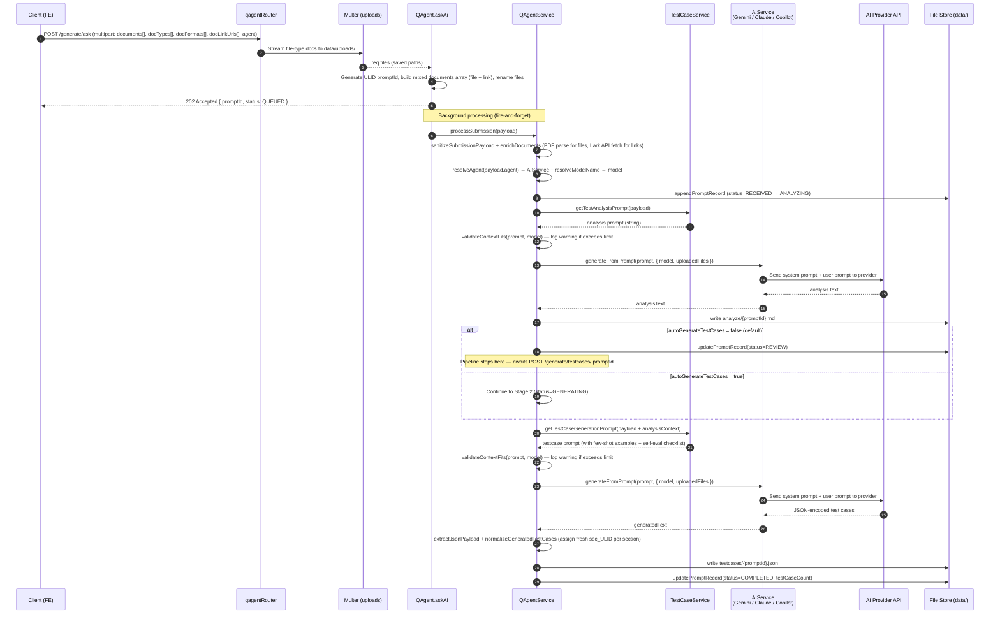

---

### 2. `GET /testcase/:promptId` — Fetch Generated Test Cases

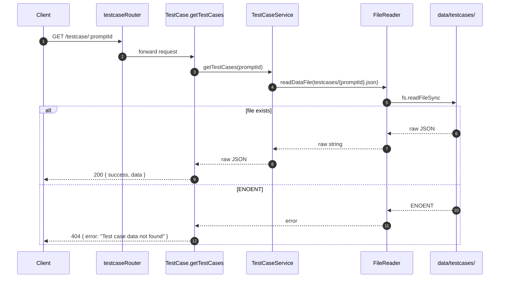

---

### 3. `GET /testcase/getAnalyzeResult/:promptId` — Fetch Analysis

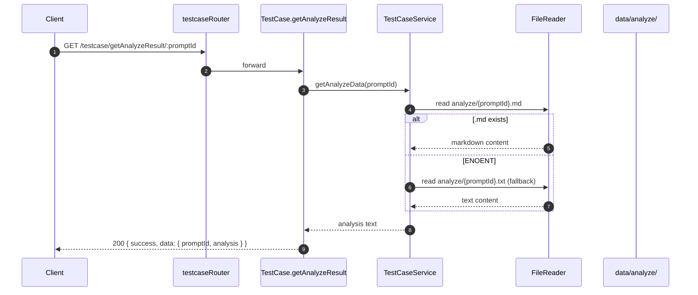

---

### 4. `POST|PUT /testcase/edit` — Edit a Test Case

Edits a single test case's fields (title, steps, preconditions, expected result, platforms, section). For bulk section moves, use `/testcase/bulkMoveSection` instead.

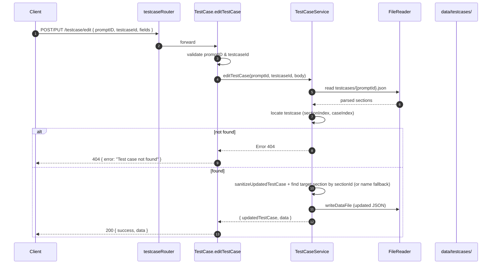

---

### 4b. `POST /testcase/bulkMoveSection` — Bulk Move Test Cases to a Section

Moves multiple test cases to a target section in a single atomic operation. Replaces the previous approach of sending N individual `/testcase/edit` calls.

**Request body:**
```json
{
  "promptId": "01KS38H9A087...",
  "testcaseIds": ["TC-001", "TC-002", "TC-003"],
  "target": {
    "sectionName": "Login Flow",
    "sectionId": "sec_01KS..." | 12345 | null,
    "suiteId": 99 | null,
    "sectionSource": "ai" | "user" | "testrail"
  },
  "platformGroup": null | "app" | "desktop-web"
}
```

**Move Section Rules:**

| Platform filter | Target section type | Behavior |
|----------------|-------------------|----------|
| All Platforms (`platformGroup: null`) | AI / User | Physical move — TC relocated to target section for all platforms |
| All Platforms (`platformGroup: null`) | TestRail | Physical move (same as above) |
| Single Platform (`platformGroup: "app"`) | TestRail only | Metadata update — TC stays in place, section meta updated for that platform only |
| Single Platform (`platformGroup: "app"`) | AI / User | **Rejected** (400) — would create inconsistent per-platform overrides |

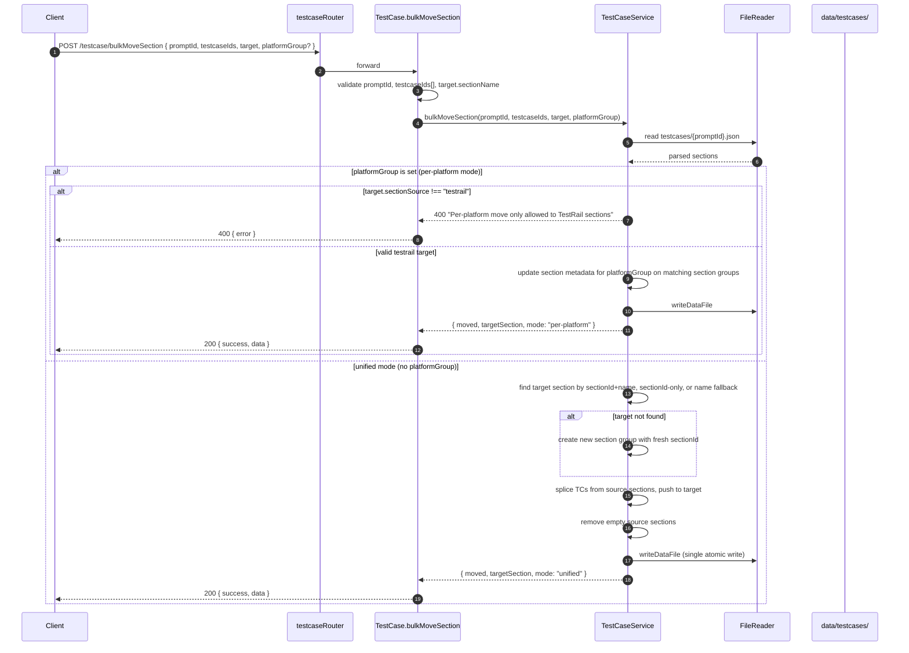

---

### 5. `POST /testcase/add` — Add a New Test Case

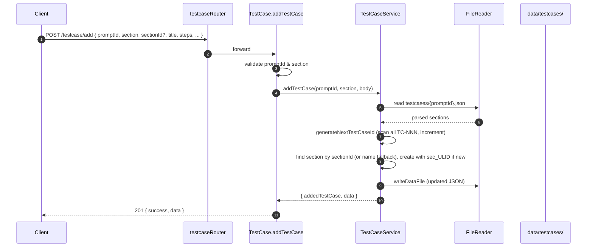

---

### 6. `PUT /testcase/editSection` — Rename a Section

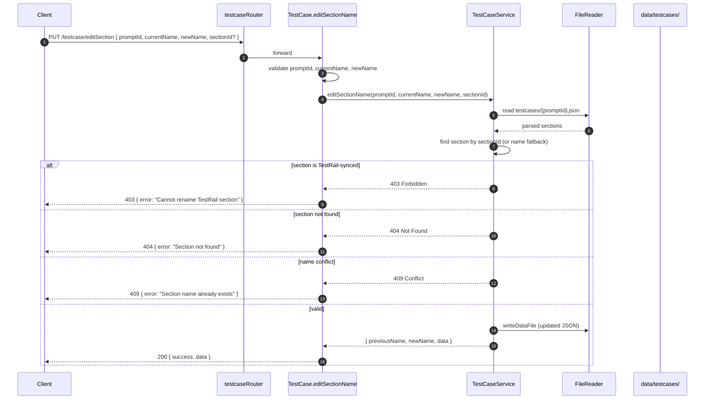

---

### 7. `DELETE /testcase/deleteTestCase/:promptId/:testcaseId`

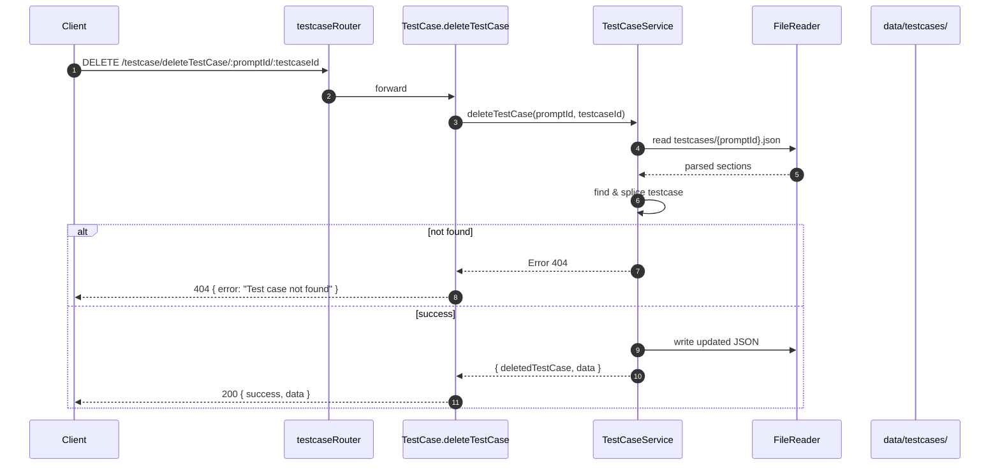

---

### 6. `GET /dashboard/` — Aggregated Dashboard

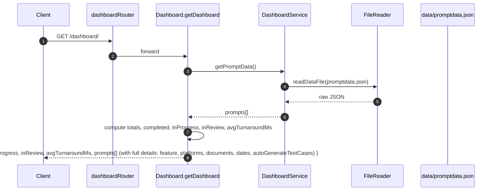

---

 ### 7. `GET /dashboard/prompts` — Lightweight Prompt List

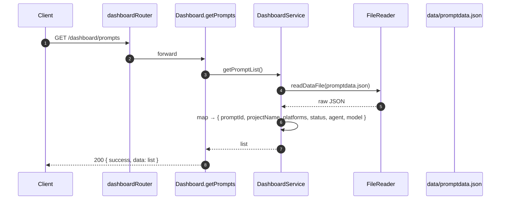

---

### 7b. `GET /dashboard/products` — Product / Domain List

Returns the list of available products from `src/prompts/references/productlist.json`. Used by the submission form to populate the **Product / Domain** multi-select field.

```
GET /dashboard/products
→ 200 { success: true, data: [{ domain, domainLabel, product, label }] }
```

**Response example:**
```json
{
  "success": true,
  "data": [
    { "domain": "pts", "domainLabel": "PTS", "product": "points", "label": "Points" },
    { "domain": "pts", "domainLabel": "PTS", "product": "cobrand", "label": "Cobrand" },
    { "domain": "platform_content_martech", "domainLabel": "Platform Content Martech", "product": "cri", "label": "CRI - Customer Reward and Incentive" }
  ]
}
```

 **Adding products:** Edit `src/prompts/references/productlist.json`. Each entry must have `domain`, `domainLabel`, `product`, `label`. The `domain` and `product` keys must match entries in `src/prompts/references/pagesmapping.json` for navigation reference enrichment to work.

---

### 8. `GET /settings/` and `GET /settings/key`

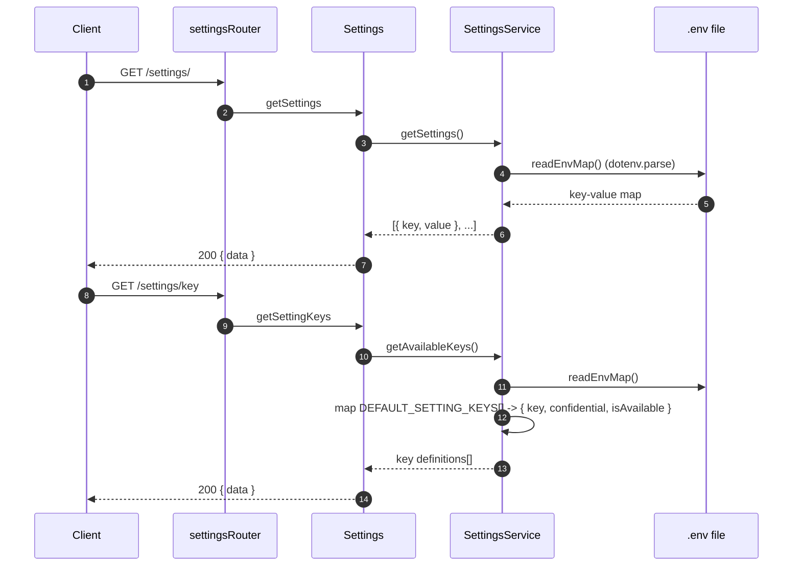

`GET /settings/key` now returns an array like:

```json
[
    {
        "key": "GEMINI_API_KEY",
        "confidential": true,
        "isAvailable": true
    }
]
```

---

### 9. `POST /settings/` — Create Settings

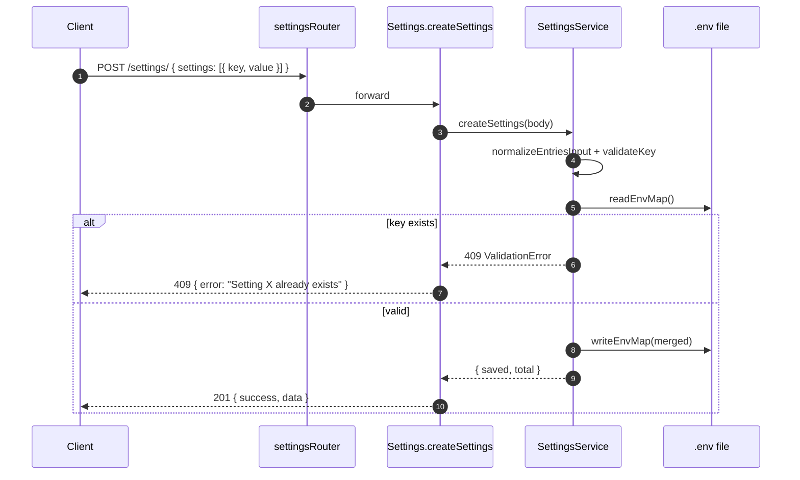

---

### 10. `PUT /settings/:key` — Update a Setting

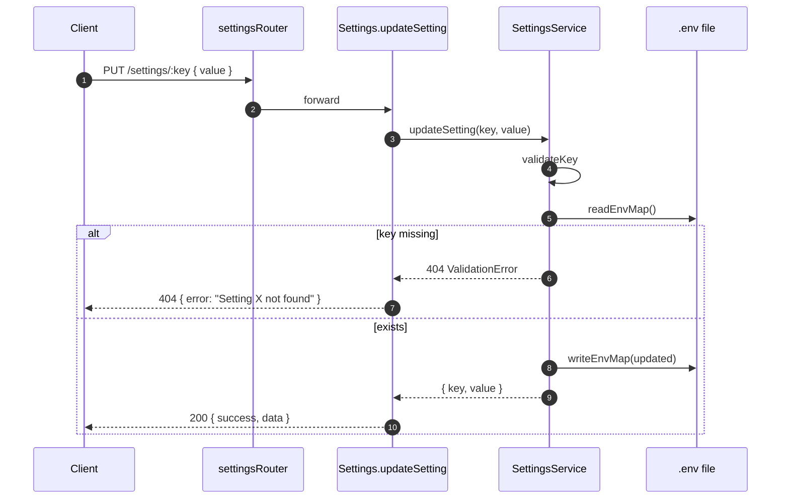

---

### 11. `DELETE /settings/:key` — Delete a Setting

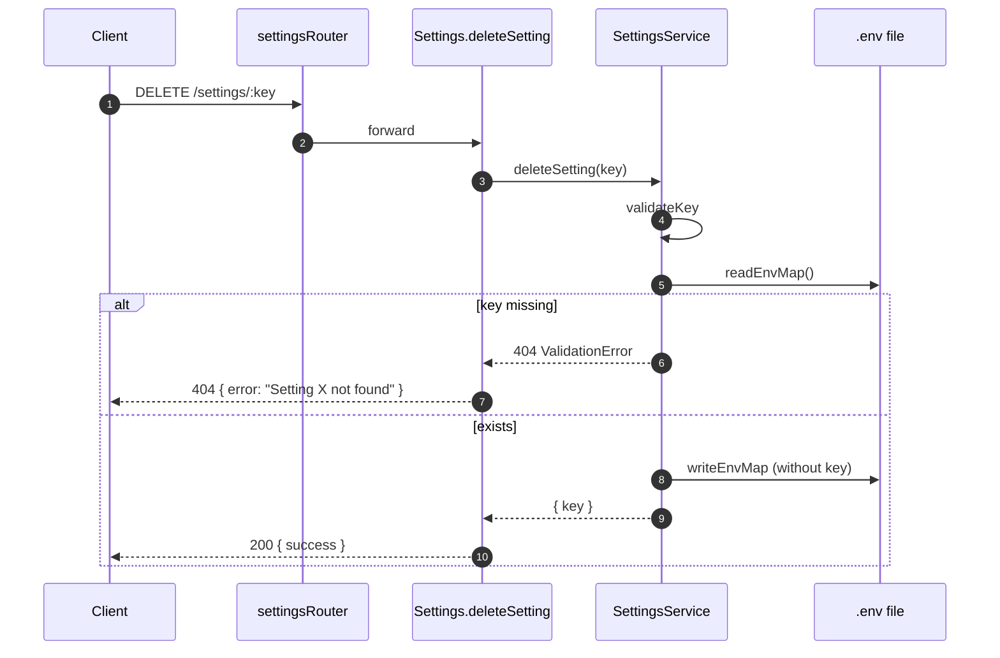

---

### 12a. `GET /testrail/getsuites` — Fetch TestRail Test Suites

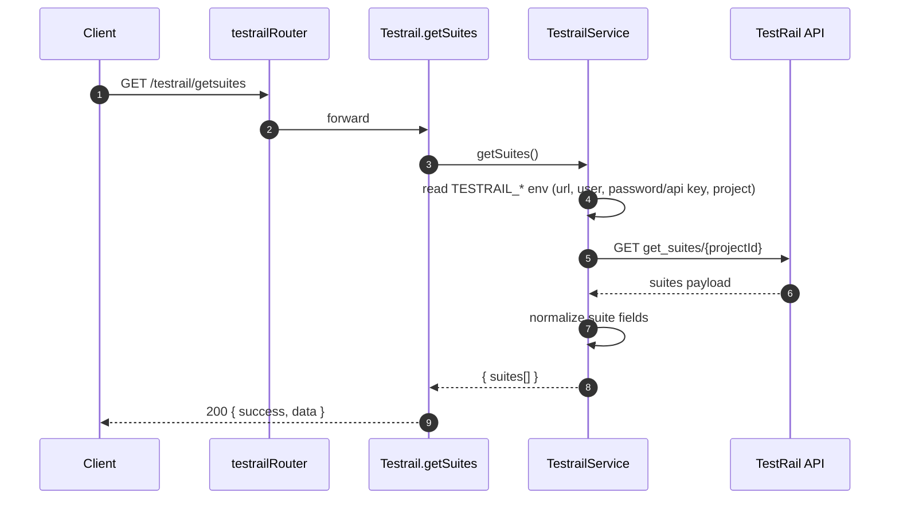

---

### 12b. `GET /testrail/getsections` — Fetch TestRail Sections

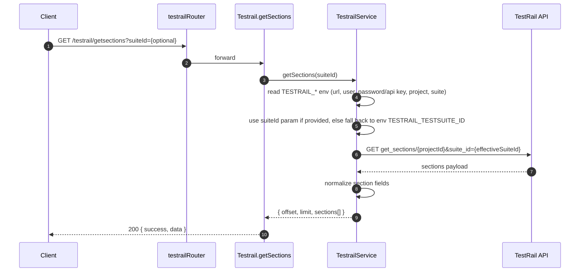

---

### 13. `POST /testrail/posttestcases` — Post Selected Test Cases to TestRail

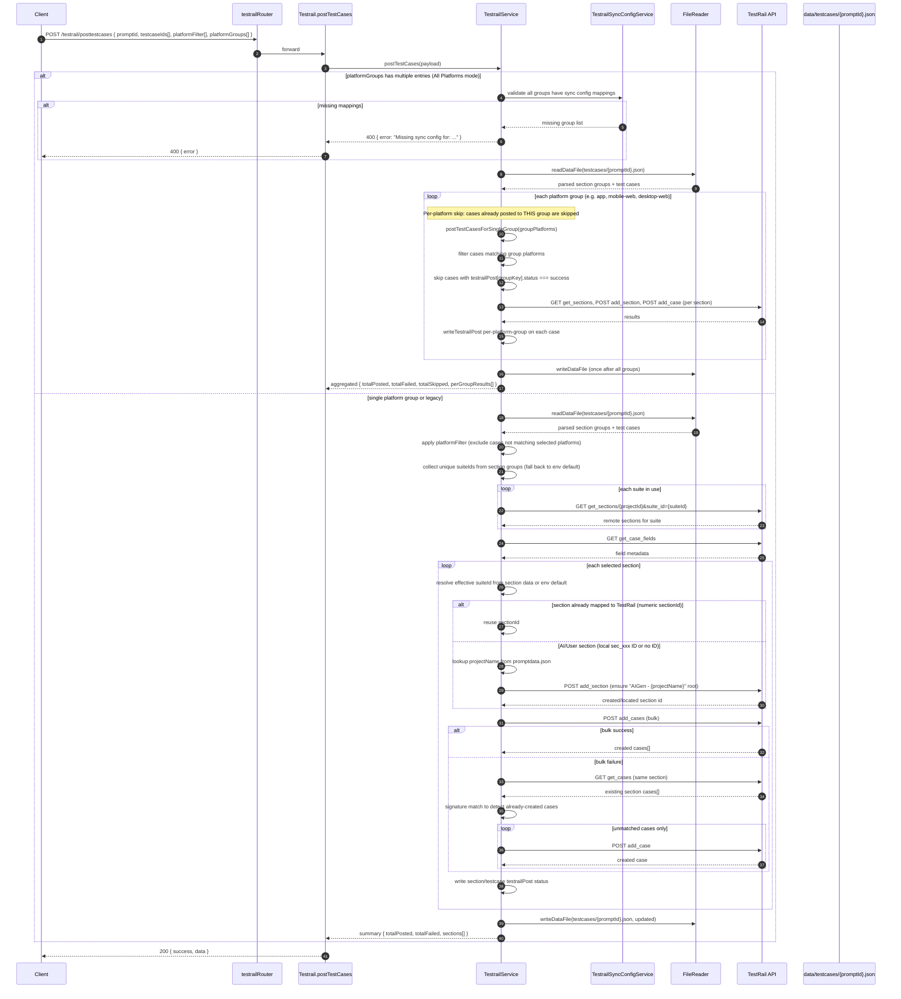

---

## Scalability & Performance

### Current Strengths
- **Asynchronous job model**: `POST /generate/ask` returns `202 Accepted` immediately. The expensive AI pipeline runs in the background, freeing the request thread. See [controller/QAgent.js](controller/QAgent.js#L77-L92).
- **Singleton AI clients**: Gemini SDK client (`GoogleGenerativeAI`) and file manager are constructed once per process and reused, avoiding per-request handshake costs. Model instances are created per-call to support dynamic model selection ([service/GeminiService.js](service/GeminiService.js)).
- **Server-side file uploads to AI Model**: Documents are uploaded to Models's File API once and referenced by URI, avoiding repeated base64 transmission. Inline base64 is used only as a fallback ([service/GeminiService.js](service/GeminiService.js#L13-L66)).
- **Two-stage prompting**: Decoupling analysis from test-case generation makes prompts smaller and improves reliability of JSON parsing.
- **Upload size limits**: `multer` enforces a 10 MB cap per file ([routes/qagentRouter.js](routes/qagentRouter.js#L29-L31)).
- **ULID identifiers**: Lexicographically sortable IDs enable efficient time-ordered scans of [data/promptdata.json](data/promptdata.json).

### Recommended Scaling Path
| Concern | Strategy |
|---|---|
| **Job persistence beyond a single process** | Replace in-process fire-and-forget with a queue (BullMQ + Redis, or AWS SQS) and a worker pool. |
| **Storage** | Migrate [data/](data/) JSON files to a database (PostgreSQL for metadata, S3/GCS for analyses & test-case JSON). Index `promptId`, `status`, `createdAt`. |
| **Caching** | Add Redis caching for `GET /testcase/:promptId` and `GET /dashboard/` responses (TTL ~30s). |
| **Horizontal scaling** | Service is stateless once storage is externalized — deploy behind a load balancer with multiple Node replicas. |
| **Rate limits** | Add `express-rate-limit` per IP for `/generate/ask` to protect Gemini quota. |
| **Backpressure** | Cap concurrent in-flight Gemini calls via a semaphore (e.g., `p-limit`). |
| **Streaming output** | Use Gemini streaming + Server-Sent Events to stream partial analyses to the FE. |
| **Observability** | Replace `console.log` with structured logging (`pino`) and add OpenTelemetry traces around each pipeline step. |

---

## Error Handling

### Strategy

1. **Validation errors** are thrown as `Error` instances enriched with `statusCode` (e.g., `SubmissionValidationError` in [service/QAgentService.js](service/QAgentService.js#L14-L20), and `createValidationError` in [service/SettingsService.js](service/SettingsService.js#L20-L24)).
2. **Controllers** wrap each handler in `try/catch`, inspect `error.code` (filesystem) and `error.statusCode` (domain), and map them to HTTP responses.
3. **Background failures** in `processSubmission` update the prompt record with `status=FAILED`, `failureNote`, `errorMessage` so the dashboard can surface them — see [service/QAgentService.js](service/QAgentService.js#L290-L300).
4. **External-service degradation** (Gemini File API upload failure) is handled with a graceful fallback to inline base64 ([service/GeminiService.js](service/GeminiService.js#L40-L60)).
5. **JSON parsing** of LLM output is defended by `extractJsonPayload`, which strips Markdown fences and slices to the first `{...}` block before failing ([service/QAgentService.js](service/QAgentService.js#L75-L93)).

### Standard Error Codes

| HTTP | Trigger | Example Response Body |
|---:|---|---|
| `200` | Successful read / mutation | `{ success: true, data: ... }` |
| `201` | Setting(s) created | `{ success: true, message: "Settings saved successfully", data }` |
| `202` | AI job accepted (async) | `{ success: true, data: { promptId, status: "QUEUED" } }` |
| `207` | TestRail posting: all cases failed | `{ success: false, message: "Failed to post all N test case(s) to TestRail", data }` |
| `400` | Missing `promptId` / `testcaseId`, invalid setting key, missing PRD | `{ success: false, error: "<message>" }` |
| `404` | Test case file not found, analyze data missing, setting key not found, test case ID not found | `{ success: false, error: "<message>" }` |
| `409` | Attempting to create a setting that already exists | `{ success: false, error: "Setting X already exists" }` |
| `500` | Unhandled error (filesystem, Gemini SDK, JSON parse, etc.) | `{ success: false, error: "<message>" }` |

### Job Status Lifecycle

```
RECEIVED → ANALYZING → REVIEW → GENERATING → COMPLETED
                  ↘ FAILED          ↘ FAILED
```

| Status | Meaning |
|--------|---------|
| `RECEIVED` | Submission accepted, queued for processing |
| `ANALYZING` | AI is generating the analysis document (Stage 1) |
| `REVIEW` | Analysis complete, awaiting user review before test case generation. Only reached when `autoGenerateTestCases = false` (default). |
| `GENERATING` | AI is generating test cases (Stage 2) |
| `COMPLETED` | Both stages finished successfully |
| `FAILED` | Any stage encountered an error (`failureNote`, `errorMessage` populated) |

**Auto-Generate Toggle**: When `autoGenerateTestCases = true`, the pipeline skips the REVIEW checkpoint and proceeds directly from ANALYZING → GENERATING → COMPLETED. When `false` (default), it stops at REVIEW and waits for the user to manually trigger generation via `POST /generate/testcases/:promptId`.

---

## Deployment & Environment

### Required Environment Variables

Stored in `.env` at the project root and managed at runtime via `/settings/*`.

| Key | Required | Description |
|---|---|---|
| `PORT` | ✗ (default `9009`) | HTTP port for the Express server |
| `GEMINI_API_KEY` | ✓ (if using `gemini`) | Google Generative AI API key |
| `GEMINI_MODEL` | ✗ (default `models/gemini-2.5-flash`) | Model id for Gemini requests |
| `CLAUDE_API_KEY` or `ANTHROPIC_API_KEY` | ✓ (if using `claude`) | Anthropic Claude API key |
| `CLAUDE_MODEL` | ✗ (default `claude-sonnet-4-6`) | Model id for Claude requests |
| `GITHUB_TOKEN` | ✓ (if using `copilot`) | GitHub token for GitHub Models API |
| `GITHUB_MODEL` | ✗ (default `openai/gpt-5-chat`) | Model id for Copilot/GitHub Models requests |
| `GITHUB_MODELS_API_URL` | ✗ | Override for inference endpoint (default `https://models.inference.ai.azure.com/chat/completions`) |
| `LARK_APP_ID` | ✓ (if using Lark links) | Lark Open Platform App ID |
| `LARK_APP_SECRET` | ✓ (if using Lark links) | Lark Open Platform App Secret |
| `FIGMA_ACCESS_TOKEN` | ✓ (if using Figma links) | Figma personal/OAuth access token for REST API |
| `OPENAI_API_KEY` | ✗ | Reserved for a future OpenAI agent |
| `TESTRAIL_URL` | ✗ | Base URL of TestRail instance (planned) |
| `TESTRAIL_USERNAME` | ✗ | TestRail user (planned) |
| `TESTRAIL_API_KEY` | ✗ | TestRail API token (planned) |
| `TESTRAIL_PROJECT_ID` | ✗ | Default TestRail project (planned) |
| `NODE_ENV` | ✗ | `development` \| `production` |

> The canonical list lives in `DEFAULT_SETTING_KEYS` inside [service/SettingsService.js](service/SettingsService.js).
> It is defined as objects: `{ key, confidential }`.

### Local Development

```bash
# 1. Install dependencies
npm install

# 2. Create .env (or use POST /settings/ once running)
echo "GEMINI_API_KEY=your_key_here" > .env
echo "CLAUDE_API_KEY=your_key_here" >> .env
echo "GITHUB_TOKEN=your_github_token_here" >> .env
echo "GITHUB_MODEL=gpt-4.1-mini" >> .env
echo "PORT=9009" >> .env

# 3. Run with hot reload
npm start
# → http://localhost:9009
```

## Project Structure

```
qe-test-case-generator/
├── app.js                   # Express bootstrap & route mounting
├── package.json
├── controller/              # HTTP handlers (thin, validation + response shaping)
│   ├── QAgent.js
│   ├── TestCase.js
│   ├── Dashboard.js
│   ├── Settings.js
│   ├── Testrail.js
│   └── TestrailSyncConfig.js
├── service/                 # Business logic
│   ├── QAgentService.js     # Orchestrates the AI pipeline
│   ├── LarkService.js       # Lark Open API integration (URL parsing, auth, content fetch)
│   ├── FigmaService.js      # Figma REST API integration (URL parsing, text/component extraction, frame images)
│   ├── ClaudeService.js     # Anthropic Claude integration
│   ├── GeminiService.js     # Google Gemini integration (Strategy/Facade)
│   ├── CopilotService.js    # GitHub Copilot/GitHub Models integration
│   ├── TestCaseService.js   # CRUD on generated test cases
│   ├── DashboardService.js
│   ├── SettingsService.js   # .env management
│   ├── TestrailService.js
│   └── TestrailSyncConfigService.js  # Platform-to-suite sync config CRUD
├── routes/                  # Express routers
├── prompts/                 # LLM prompt templates
│   ├── index.js
│   └── testCaseGeneration.js
├── utils/
│   ├── AppLogger.js         # Structured action logger for pipeline steps
│   ├── BaseUtils.js
│   ├── FileExtractor.js     # Multer file → metadata helpers
│   ├── FileReader.js        # Read/write under data/
│   └── TokenEstimator.js    # Token estimation & context limit validation
├── data/                    # Persisted artifacts (job records, analyses, test cases)
│   └── testrail-sync-config.json  # Platform-to-suite mappings (runtime-managed)
└── public/                  # Static frontend (HTML/CSS/JS)
```

---

_Generated documentation. Contributions welcome — open a PR against `main`._
