# QE Test Case Generator

> An AI-assisted backend service that converts product specifications (PRD, RFC, Figma) into structured, reviewable QA test cases — automating one of the most time-consuming activities in the QA lifecycle.

---

## Table of Contents

1. [Feature Overview](#feature-overview)
2. [Tech Stack](#tech-stack)
3. [Design Patterns](#design-patterns)
4. [Use Cases & Sequence Diagrams](#use-cases--sequence-diagrams)
5. [Scalability & Performance](#scalability--performance)
6. [Error Handling](#error-handling)
7. [Deployment & Environment](#deployment--environment)
8. [Project Structure](#project-structure)

---

## Feature Overview

The **QE Test Case Generator** is a Node.js / Express backend that ingests product artifacts (PRD, RFC, Figma references), forwards them to a Generative AI agent (Claude, Gemini, or GitHub Copilot), and produces:

1. A **structured analysis** (Markdown) of the feature.
2. A **machine-readable list of test cases** (JSON) grouped by section, including title, type, priority, preconditions, steps, and expected results.

### Problems It Solves

| Problem | Solution |
|---|---|
| Manual test-case authoring is slow and inconsistent | LLM-driven generation with a deterministic, structured prompt pipeline |
| QA loses context when PRDs are scattered across PDFs / Figma | Multi-document ingestion (PDF, MD, TXT, links) merged into a single context |
| Test cases are hard to track and revise | Persistent prompt records, editable test cases, dashboard analytics |
| Reusing AI outputs across teams | Stable identifiers (ULID) and file-based artifacts under [data/](data/) |
| Sensitive credentials must remain local | Local `.env`-driven Settings API, no remote config dependency |

### Primary Capabilities

- **Submit & Analyze** — Upload PRD/RFC/Figma documents and receive an asynchronous job ID.
- **Two-Stage AI Pipeline** — Step 1 produces an analysis; Step 2 produces test cases grounded on that analysis.
- **CRUD on Test Cases** — Edit, move between sections, and delete generated test cases.
- **Dashboard Analytics** — Aggregate counts, turnaround time, and failure notes.
- **Runtime Settings** — Manage application secrets (API keys, ports) via a REST surface backed by `.env`.
- **TestRail Integration** — Fetch sections, auto-create missing sections, and post selected test cases to TestRail.

---

## Tech Stack

### Languages & Runtime
- **JavaScript (Node.js)** — Server runtime
- **HTML / CSS / Vanilla JS** — Frontend in [public/](public/)

### Frameworks & Libraries
| Category | Library |
|---|---|
| Web framework | [express](https://expressjs.com/) `~4.16.1` |
| File uploads | [multer](https://www.npmjs.com/package/multer) `^2.1.1` |
| Cross-Origin | [cors](https://www.npmjs.com/package/cors) `^2.8.6` |
| Configuration | [dotenv](https://www.npmjs.com/package/dotenv) `^17.4.2` |
| AI SDK | [@google/generative-ai](https://www.npmjs.com/package/@google/generative-ai) `^0.24.1` |
| PDF parsing | [pdf-parse](https://www.npmjs.com/package/pdf-parse) `^2.4.5` |
| ID generation | [ulid](https://www.npmjs.com/package/ulid) `^2.4.0` |
| Dev tooling | [nodemon](https://www.npmjs.com/package/nodemon) |

### Persistence
- **File-based storage** under [data/](data/):
  - [data/promptdata.json](data/promptdata.json) — Prompt/job metadata
  - [data/analyze/](data/analyze/) — Per-prompt Markdown analyses
  - [data/testcases/](data/testcases/) — Per-prompt JSON test cases
  - [data/uploads/](data/uploads/) — Raw uploaded user files

### External Services
- **Google Gemini API** — `models/gemini-2.5-flash` for analysis & generation
- **Anthropic Claude API** — Claude chat completion endpoint for analysis & generation
- **GitHub Models API** — GitHub Copilot-compatible model inference (`/chat/completions`)
- **TestRail API** — Sections + Cases sync (`get_sections`, `add_section`, `add_cases` / `add_case` fallback)

---

## Design Patterns

The backend follows a **layered (Clean / N-tier) architecture** with a clear separation between transport, orchestration, domain logic, and infrastructure concerns.

```
Routes  →  Controller  →  Service  →  Utils / External APIs / File Store
```

| Pattern | Where It Is Used | Justification |
|---|---|---|
| **Layered Architecture** | [routes/](routes/), [controller/](controller/), [service/](service/), [utils/](utils/) | Keeps HTTP concerns out of business logic; each layer is independently testable. |
| **Strategy Pattern** | `AGENTS` map in [service/QAgentService.js](service/QAgentService.js#L10-L21) | Pluggable AI agents (`claude`, `gemini`, `copilot`) selected at runtime via `normalizeAgentName`. |
| **Template Method** | [prompts/index.js](prompts/index.js), [prompts/testCaseGeneration.js](prompts/testCaseGeneration.js) | `buildTestAnalysisPrompt` and `buildTestCaseGenerationPrompt` follow a fixed scaffold filled by inputs. |
| **Repository (file-backed)** | `readPromptData` / `writePromptData` in [service/QAgentService.js](service/QAgentService.js#L28-L46), [utils/FileReader.js](utils/FileReader.js) | Abstracts storage so the JSON-on-disk layer can later be swapped for a database. |
| **DTO / Sanitizer** | `sanitizeSubmissionPayload`, `sanitizeUpdatedTestCase` | Normalizes untrusted input into a stable internal contract. |
| **Factory** | `createInitialRecord` in [service/QAgentService.js](service/QAgentService.js#L113-L131) | Centralizes the construction of a normalized prompt record. |
| **Async Job / Fire-and-Forget** | [controller/QAgent.js](controller/QAgent.js#L77-L92) | Returns `202 Accepted` and continues processing in the background. |
| **Validation Error** | `SubmissionValidationError` class | Structured, status-code-aware errors propagated to the controller. |

---

## Use Cases & Sequence Diagrams

The service exposes the following routes (mounted in [app.js](app.js)):

| Method | Path | Handler | Description |
|---|---|---|---|
| `POST` | `/generate/ask` | [controller/QAgent.js](controller/QAgent.js) | Submit PRD/RFC/Figma and start AI generation |
| `GET`  | `/testcase/:promptId` | [controller/TestCase.js](controller/TestCase.js) | Fetch generated test cases |
| `GET`  | `/testcase/getAnalyzeResult/:promptId` | [controller/TestCase.js](controller/TestCase.js) | Fetch analysis Markdown |
| `POST`/`PUT` | `/testcase/edit` | [controller/TestCase.js](controller/TestCase.js) | Update / move a test case |
| `DELETE` | `/testcase/deleteTestCase/:promptId/:testcaseId` | [controller/TestCase.js](controller/TestCase.js) | Delete a test case |
| `GET` | `/dashboard/` | [controller/Dashboard.js](controller/Dashboard.js) | Aggregate metrics |
| `GET` | `/dashboard/prompts` | [controller/Dashboard.js](controller/Dashboard.js) | List prompts (id + project) |
| `GET` | `/dashboard/log/:promptId` | [controller/Dashboard.js](controller/Dashboard.js) | Get processing log for a prompt |
| `GET` | `/settings/` | [controller/Settings.js](controller/Settings.js) | List `.env` entries |
| `GET` | `/settings/key` | [controller/Settings.js](controller/Settings.js) | List default key metadata (`key`, `confidential`, `isAvailable`) |
| `POST` | `/settings/` | [controller/Settings.js](controller/Settings.js) | Create new settings |
| `PUT` | `/settings/:key` | [controller/Settings.js](controller/Settings.js) | Update a single setting |
| `DELETE` | `/settings/:key` | [controller/Settings.js](controller/Settings.js) | Delete a setting |
| `GET` | `/testrail/getsections` | [controller/Testrail.js](controller/Testrail.js) | Fetch sections from TestRail |
| `POST` | `/testrail/posttestcases` | [controller/Testrail.js](controller/Testrail.js) | Post selected prompt test cases to TestRail |

### API Contracts

See [API_CONTRACT.md](API_CONTRACT.md) for full request/response documentation of all endpoints.

### TestRail Posting Data Contract (file-backed)

When posting test cases to TestRail, section metadata in [data/testcases/](data/testcases/) is updated so future syncs can reuse the right TestRail section:

- `sectionId`: target TestRail section ID
- `suiteId`: TestRail suite ID from environment
- `sectionSource`: set to `testrail` after successful section resolution
- `testrailPost`: section-level posting audit object:
    - `status`: `success` / `partial` / `failed`
    - `lastAttemptAt`, `lastPostedAt`
    - `message`, `postedCount`, `failedCount`
    - `targetSectionId`, `targetSectionName`, `sectionMode`

Each posted test case also gets a `testrailPost` object with per-case status and returned `testrailCaseId` when available.

### TestRail Case Payload Mapping

When posting each case to TestRail, the service uses this payload shape:

- `section_id`: target TestRail section id
- `title`: test case title
- Fixed fields (kept unchanged):
    - `template_id: 2`
    - `type_id: 6`
    - `priority_id: 2`
    - `custom_test_info: 7`
    - `custom_automation_type: 0`
    - `custom_automation_types: [5]`
- `custom_preconds`: normalized preconditions
- `custom_steps_separated`: each step is mapped as:
    - `content`: step action text
    - `expected`: expected result for that specific step (or "N/A" if not applicable)


### Duplicate-Safe Retry Behavior

Posting flow is **bulk-first** per section, then **one-by-one fallback** only when bulk fails:

1. Try `add_cases` for all selected cases in the section.
2. If bulk fails, fetch current section cases from TestRail (`get_cases`).
3. Build a normalized content signature (`title + preconditions + steps/expected`).
4. For any matching signature already present, skip `add_case` retry and reuse existing case id.
5. Retry `add_case` only for unmatched cases.

This minimizes duplicate creation during partial failures.

---

### 1. `POST /generate/ask` — Submit and Generate Test Cases

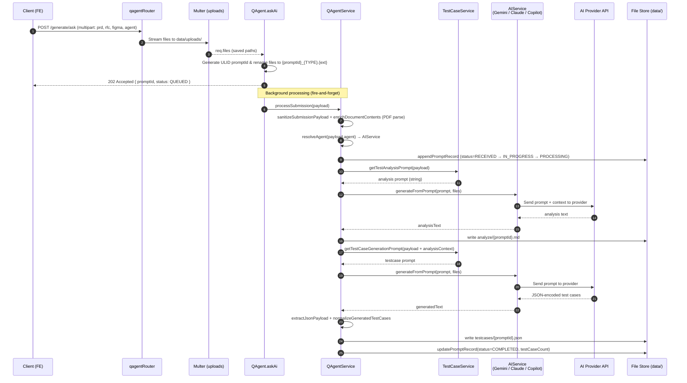

---

### 2. `GET /testcase/:promptId` — Fetch Generated Test Cases

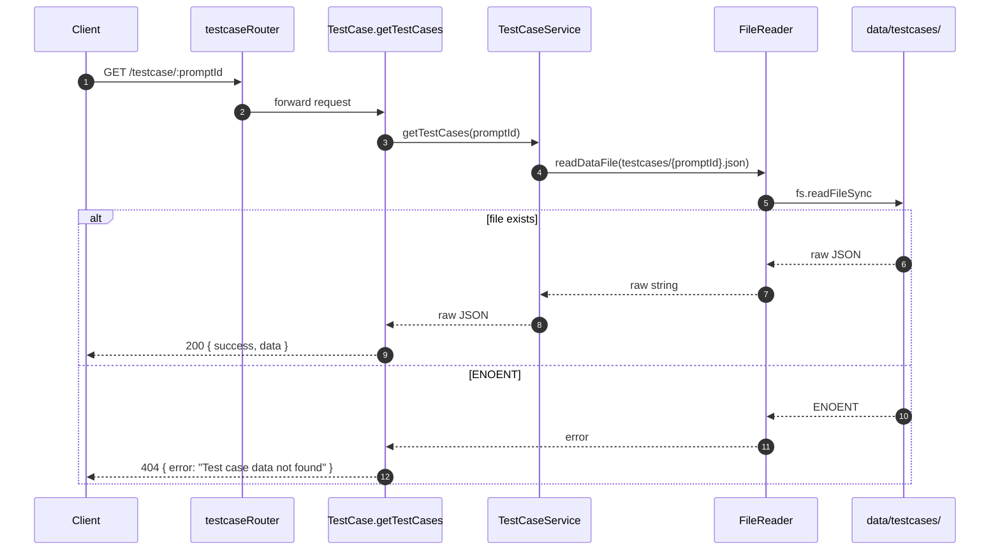

---

### 3. `GET /testcase/getAnalyzeResult/:promptId` — Fetch Analysis

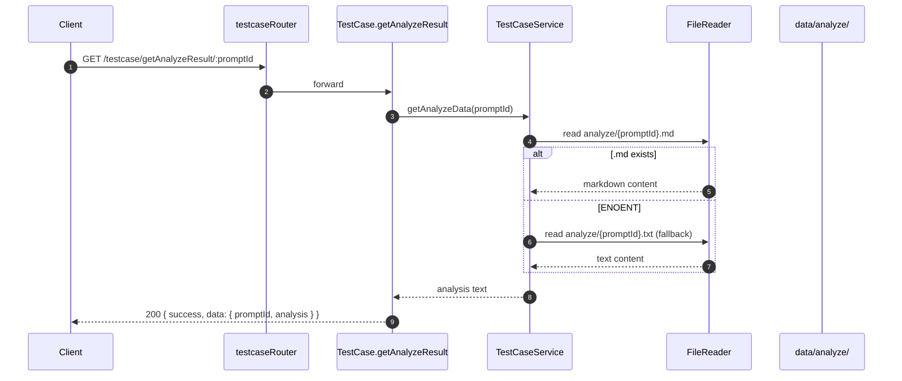

---

### 4. `POST|PUT /testcase/edit` — Edit / Move a Test Case

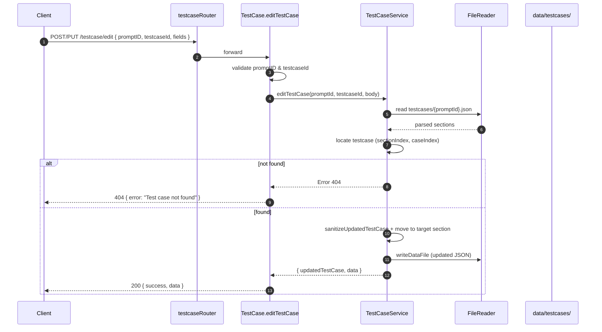

---

### 5. `DELETE /testcase/deleteTestCase/:promptId/:testcaseId`

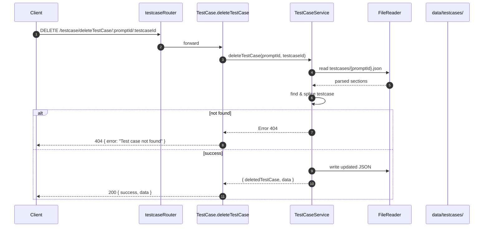

---

### 6. `GET /dashboard/` — Aggregated Dashboard

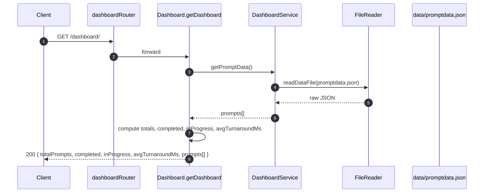

---

### 7. `GET /dashboard/prompts` — Lightweight Prompt List

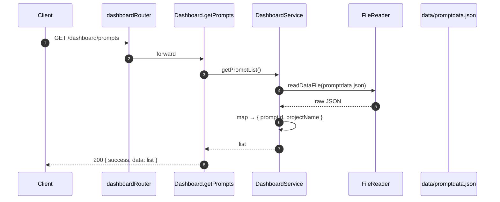

---

### 8. `GET /settings/` and `GET /settings/key`

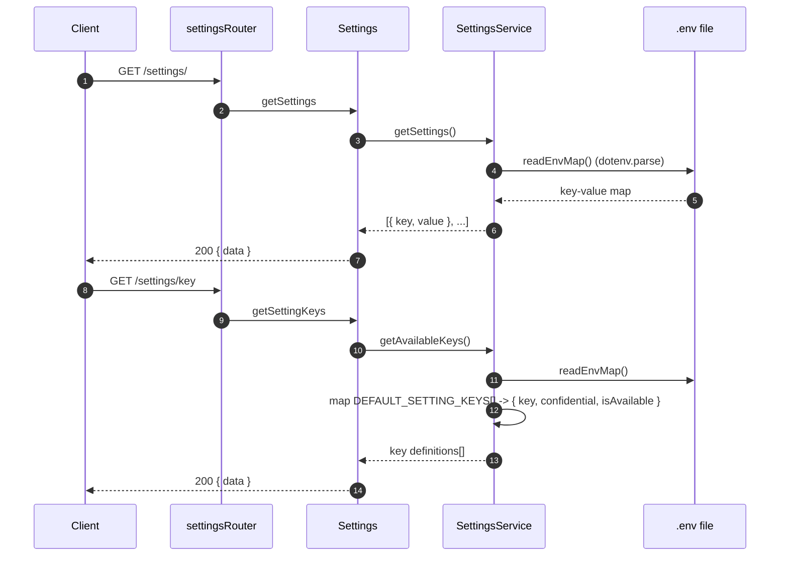

`GET /settings/key` now returns an array like:

```json
[
    {
        "key": "GEMINI_API_KEY",
        "confidential": true,
        "isAvailable": true
    }
]
```

---

### 9. `POST /settings/` — Create Settings

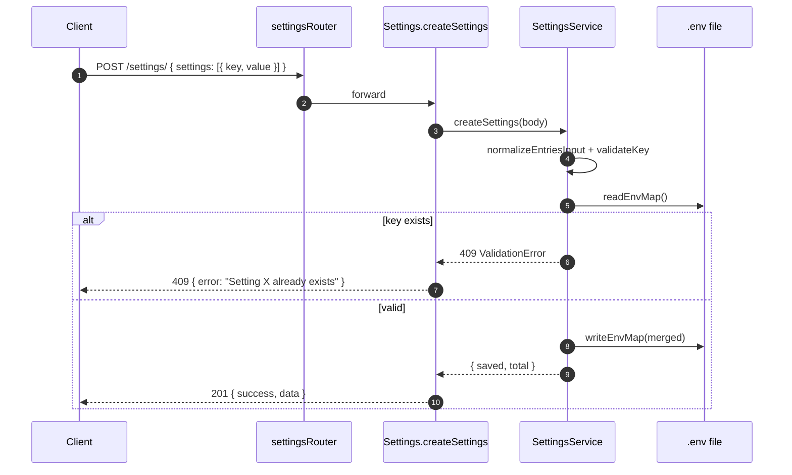

---

### 10. `PUT /settings/:key` — Update a Setting

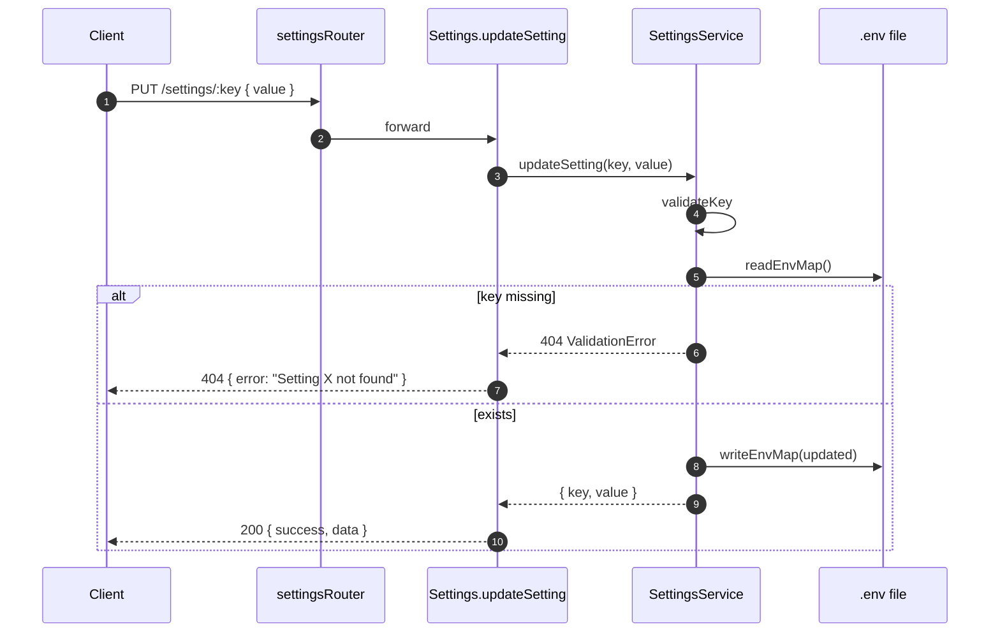

---

### 11. `DELETE /settings/:key` — Delete a Setting

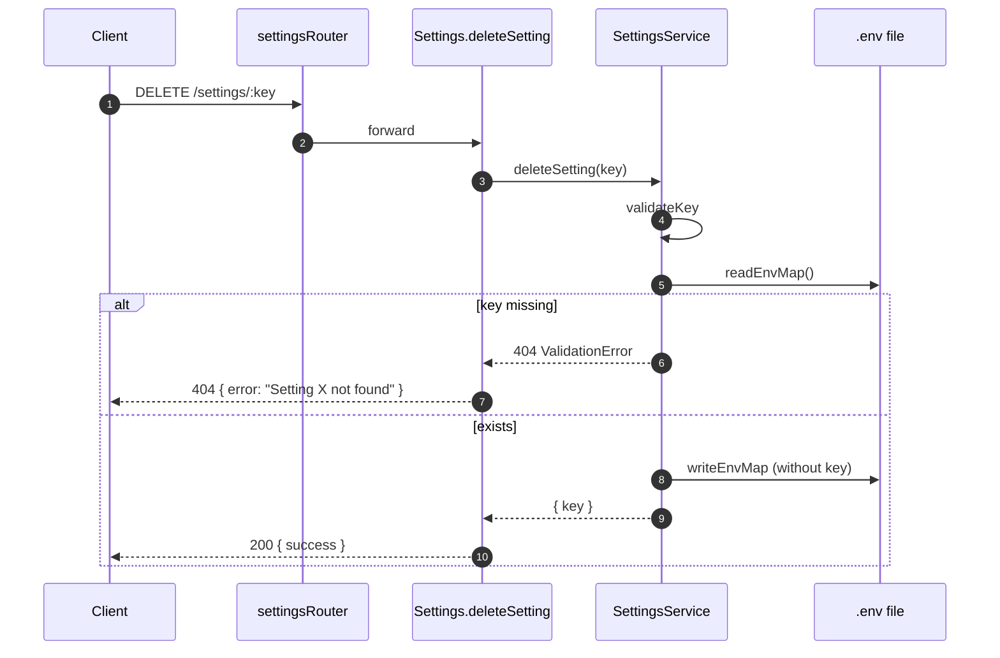

---

### 12. `GET /testrail/getsections` — Fetch TestRail Sections

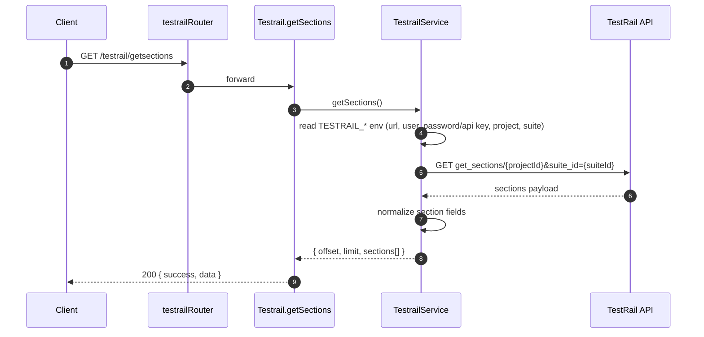

---

### 13. `POST /testrail/posttestcases` — Post Selected Test Cases to TestRail

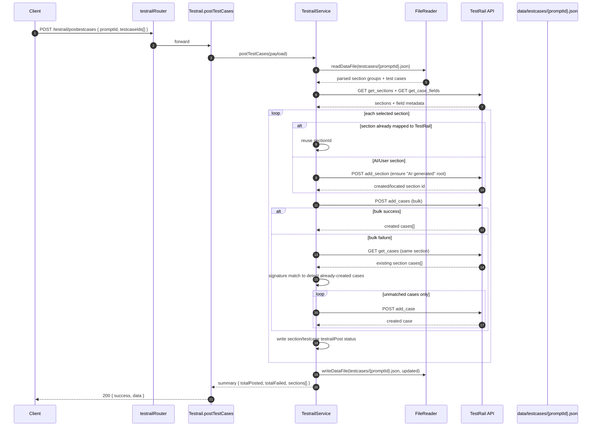

---

## Scalability & Performance

### Current Strengths
- **Asynchronous job model**: `POST /generate/ask` returns `202 Accepted` immediately. The expensive AI pipeline runs in the background, freeing the request thread. See [controller/QAgent.js](controller/QAgent.js#L77-L92).
- **Singleton AI clients**: Gemini SDK clients are constructed once per process and reused, avoiding per-request handshake costs ([service/GeminiService.js](service/GeminiService.js#L6-L9)).
- **Server-side file uploads to AI Model**: Documents are uploaded to Models's File API once and referenced by URI, avoiding repeated base64 transmission. Inline base64 is used only as a fallback ([service/GeminiService.js](service/GeminiService.js#L13-L66)).
- **Two-stage prompting**: Decoupling analysis from test-case generation makes prompts smaller and improves reliability of JSON parsing.
- **Upload size limits**: `multer` enforces a 10 MB cap per file ([routes/qagentRouter.js](routes/qagentRouter.js#L29-L31)).
- **ULID identifiers**: Lexicographically sortable IDs enable efficient time-ordered scans of [data/promptdata.json](data/promptdata.json).

### Recommended Scaling Path
| Concern | Strategy |
|---|---|
| **Job persistence beyond a single process** | Replace in-process fire-and-forget with a queue (BullMQ + Redis, or AWS SQS) and a worker pool. |
| **Storage** | Migrate [data/](data/) JSON files to a database (PostgreSQL for metadata, S3/GCS for analyses & test-case JSON). Index `promptId`, `status`, `createdAt`. |
| **Caching** | Add Redis caching for `GET /testcase/:promptId` and `GET /dashboard/` responses (TTL ~30s). |
| **Horizontal scaling** | Service is stateless once storage is externalized — deploy behind a load balancer with multiple Node replicas. |
| **Rate limits** | Add `express-rate-limit` per IP for `/generate/ask` to protect Gemini quota. |
| **Backpressure** | Cap concurrent in-flight Gemini calls via a semaphore (e.g., `p-limit`). |
| **Streaming output** | Use Gemini streaming + Server-Sent Events to stream partial analyses to the FE. |
| **Observability** | Replace `console.log` with structured logging (`pino`) and add OpenTelemetry traces around each pipeline step. |

---

## Error Handling

### Strategy

1. **Validation errors** are thrown as `Error` instances enriched with `statusCode` (e.g., `SubmissionValidationError` in [service/QAgentService.js](service/QAgentService.js#L14-L20), and `createValidationError` in [service/SettingsService.js](service/SettingsService.js#L20-L24)).
2. **Controllers** wrap each handler in `try/catch`, inspect `error.code` (filesystem) and `error.statusCode` (domain), and map them to HTTP responses.
3. **Background failures** in `processSubmission` update the prompt record with `status=FAILED`, `failureNote`, `errorMessage` so the dashboard can surface them — see [service/QAgentService.js](service/QAgentService.js#L290-L300).
4. **External-service degradation** (Gemini File API upload failure) is handled with a graceful fallback to inline base64 ([service/GeminiService.js](service/GeminiService.js#L40-L60)).
5. **JSON parsing** of LLM output is defended by `extractJsonPayload`, which strips Markdown fences and slices to the first `{...}` block before failing ([service/QAgentService.js](service/QAgentService.js#L75-L93)).

### Standard Error Codes

| HTTP | Trigger | Example Response Body |
|---:|---|---|
| `200` | Successful read / mutation | `{ success: true, data: ... }` |
| `201` | Setting(s) created | `{ success: true, message: "Settings saved successfully", data }` |
| `202` | AI job accepted (async) | `{ success: true, data: { promptId, status: "QUEUED" } }` |
| `400` | Missing `promptId` / `testcaseId`, invalid setting key, missing PRD | `{ success: false, error: "<message>" }` |
| `404` | Test case file not found, analyze data missing, setting key not found, test case ID not found | `{ success: false, error: "<message>" }` |
| `409` | Attempting to create a setting that already exists | `{ success: false, error: "Setting X already exists" }` |
| `500` | Unhandled error (filesystem, Gemini SDK, JSON parse, etc.) | `{ success: false, error: "<message>" }` |

### Job Status Lifecycle

```
RECEIVED → IN_PROGRESS → PROCESSING → COMPLETED
                                   ↘ FAILED (failureNote, errorMessage)
```

---

## Deployment & Environment

### Required Environment Variables

Stored in `.env` at the project root and managed at runtime via `/settings/*`.

| Key | Required | Description |
|---|---|---|
| `PORT` | ✗ (default `9009`) | HTTP port for the Express server |
| `GEMINI_API_KEY` | ✓ (if using `gemini`) | Google Generative AI API key |
| `CLAUDE_API_KEY` or `ANTHROPIC_API_KEY` | ✓ (if using `claude`) | Anthropic Claude API key |
| `GITHUB_TOKEN` | ✓ (if using `copilot`) | GitHub token for GitHub Models API |
| `GITHUB_MODEL` | ✗ (default `gpt-4.1-mini`) | Model id for Copilot/GitHub Models requests |
| `GITHUB_MODELS_API_URL` | ✗ | Override for inference endpoint (default `https://models.inference.ai.azure.com/chat/completions`) |
| `OPENAI_API_KEY` | ✗ | Reserved for a future OpenAI agent |
| `TESTRAIL_URL` | ✗ | Base URL of TestRail instance (planned) |
| `TESTRAIL_USERNAME` | ✗ | TestRail user (planned) |
| `TESTRAIL_API_KEY` | ✗ | TestRail API token (planned) |
| `TESTRAIL_PROJECT_ID` | ✗ | Default TestRail project (planned) |
| `NODE_ENV` | ✗ | `development` \| `production` |

> The canonical list lives in `DEFAULT_SETTING_KEYS` inside [service/SettingsService.js](service/SettingsService.js).
> It is defined as objects: `{ key, confidential }`.

### Local Development

```bash
# 1. Install dependencies
npm install

# 2. Create .env (or use POST /settings/ once running)
echo "GEMINI_API_KEY=your_key_here" > .env
echo "CLAUDE_API_KEY=your_key_here" >> .env
echo "GITHUB_TOKEN=your_github_token_here" >> .env
echo "GITHUB_MODEL=gpt-4.1-mini" >> .env
echo "PORT=9009" >> .env

# 3. Run with hot reload
npm start
# → http://localhost:9009
```

## Project Structure

```
qe-test-case-generator/
├── app.js                   # Express bootstrap & route mounting
├── package.json
├── controller/              # HTTP handlers (thin, validation + response shaping)
│   ├── QAgent.js
│   ├── TestCase.js
│   ├── Dashboard.js
│   ├── Settings.js
│   └── Testrail.js
├── service/                 # Business logic
│   ├── QAgentService.js     # Orchestrates the AI pipeline
│   ├── ClaudeService.js     # Anthropic Claude integration
│   ├── GeminiService.js     # Google Gemini integration (Strategy/Facade)
│   ├── CopilotService.js    # GitHub Copilot/GitHub Models integration
│   ├── TestCaseService.js   # CRUD on generated test cases
│   ├── DashboardService.js
│   ├── SettingsService.js   # .env management
│   └── TestrailService.js
├── routes/                  # Express routers
├── prompts/                 # LLM prompt templates
│   ├── index.js
│   └── testCaseGeneration.js
├── utils/
│   ├── BaseUtils.js
│   ├── FileExtractor.js     # Multer file → metadata helpers
│   └── FileReader.js        # Read/write under data/
├── data/                    # Persisted artifacts (job records, analyses, test cases)
└── public/                  # Static frontend (HTML/CSS/JS)
```

---

_Generated documentation. Contributions welcome — open a PR against `main`._
